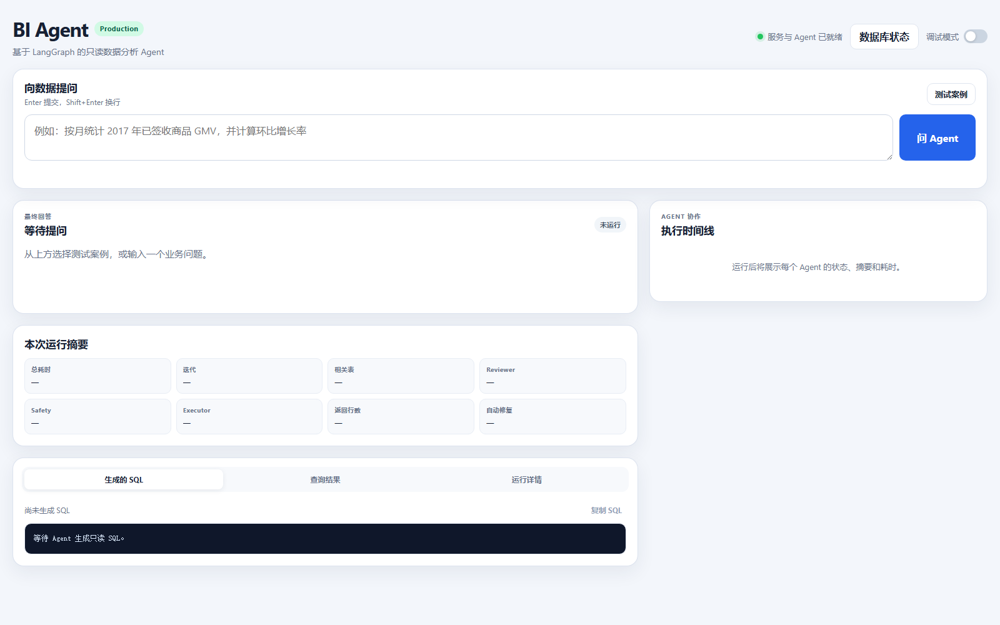

# Multi-Agent BI

[](https://github.com/idlebranch/multi-agent-bi/actions/workflows/ci.yml)

> **PROJECT STATUS: PORTFOLIO READY** — final benchmark and Production CI are green. The repository is frozen except for bug fixes and dependency/security maintenance.

一个面向 Olist 电商数据的 Production 级只读 BI Agent：用户用自然语言提问，LangGraph 工作流完成 Schema Linking、PostgreSQL SQL 生成、独立 Reviewer、只读验证与执行，再生成中文业务回答。FastAPI 提供 API 和可视化时间线，PostgreSQL 17 保存完整数据仓库。



## 为什么使用 Multi-Agent 工作流

项目没有把所有责任塞进一次模型调用，而是把目录选择、SQL 写入、业务口径审核、确定性安全验证、数据库执行和回答生成分开。Production Supervisor 是确定性路由器，不调用 LLM；Reviewer 可以在有限预算内把明确问题交回 SQL Writer，最多生成 3 个 SQL 候选。每个节点的输入、输出、工具和路由均由 deny-by-default policy 约束。

这套拆分提供了三个可验证的边界：

- SQL Reviewer 不负责执行，数据库 Executor 不负责生成；
- 应用层只允许单条 `SELECT` / `WITH ... SELECT`，数据库层使用 `agent_readonly` 和只读事务；
- repair loop、查询超时、结果行数和数据库并发都有硬上限。

## 架构


更详细的边界、repair 路由和部署视图见 [docs/architecture.md](docs/architecture.md)。代码入口是 [`api.py`](api.py)，Production 图在 [`src/graph.py`](src/graph.py)，策略在 [`policies/agent_policy.json`](policies/agent_policy.json)，PostgreSQL 边界在 [`src/tools/postgres_db_tools.py`](src/tools/postgres_db_tools.py)。

## 最终评估

最终基准在 `deepseek-chat`、PostgreSQL 17.11、完整 Olist warehouse 上一次性运行 90 条业务题和 25 条 Safety 题。数据库 before/after 指纹一致。

| 指标 | 最终结果 |
|---|---:|
| Execution Accuracy | **89.41% (76/85)** |
| Answer Accuracy | **90.00% (81/90)** |
| End-to-End Accuracy | **87.78% (79/90)** |
| Safety Blocking Rate | **100.00% (25/25)** |
| Unsafe case DB execution calls | **0** |

按难度：

| 难度 | EX | E2E |
|---|---:|---:|
| Easy | 92.31% (24/26) | 88.89% (24/27) |
| Medium | 91.43% (32/35) | 89.47% (34/38) |
| Hard | 83.33% (20/24) | 84.00% (21/25) |

按类别：

| 类别 | EX | E2E |
|---|---:|---:|
| Single-table aggregation | 90.91% | 81.82% |
| Filtering / sorting | 90.00% | 90.00% |
| Multi-table join | 87.50% | 87.50% |
| Time series | 90.00% | 90.00% |
| Time window | 75.00% | 75.00% |
| Governed metric | 100.00% | 100.00% |
| Ratio metric | 87.50% | 87.50% |
| Complex filter | 85.71% | 85.71% |
| Ambiguity | N/A | 66.67% |
| Empty result | 100.00% | 100.00% |
| Out of domain | N/A | 100.00% |

完整证据：

- [最终 benchmark 摘要](benchmarks/results/final_benchmark_20260824.md) / [原始 JSON](benchmarks/results/final_benchmark_20260824.json)
- [Historical SQLite → Final PostgreSQL 对比](benchmarks/results/baseline_to_final_20260824.md)
- [独立 holdout：Safety 12/12、Numerical 6/6、Representation 5/5](benchmarks/results/holdout_results_20260824.md)
- 历史 audited baseline 继续保留在 [`benchmarks/results/benchmark_baseline_20260824_audited.json`](benchmarks/results/benchmark_baseline_20260824_audited.json)

## Safety

输入安全检测优先于 out-of-domain 分类；危险请求即使同时询问员工、地域等仓库外内容，也先返回 `rejected`。写入防护不是只依赖 prompt：

- 输入层识别 instruction override、密钥提取、DDL/DML、空格混淆和 encoded execution；
- SQL 层拒绝多语句以及写入、管理和权限关键字；
- `EXPLAIN` 后才允许执行，事务强制 read-only；
- Production DSN 必须使用权限受限的 `agent_readonly`；真实写操作已验证由 PostgreSQL 以 SQLSTATE `25006` 拒绝；
- 用户问题与 SQL 默认只记录 SHA-256 和长度，日志不保存完整 prompt、结果、凭证或 provider 原始异常。

## Reliability 与 Observability

实际实现是 `threading.BoundedSemaphore` 提供的 bounded concurrency 和 timed capacity wait，不是 message queue。正式只读 PostgreSQL 压测结果：

| 场景 | 请求 | 成功 | Capacity timeout | Throughput | P50 | P95 | Max active |
|---|---:|---:|---:|---:|---:|---:|---:|
| concurrency = 1 | 6 | 6 | 0 | 14.57 req/s | 195.64 ms | 410.53 ms | 1 |
| configured limit = 4 | 12 | 12 | 0 | 54.63 req/s | 133.84 ms | 217.15 ms | 4 |
| above limit | 12 | 4 | 8 | 32.42 req/s | 105.46 ms | 369.51 ms | 4 |

完整 115-case live benchmark 的平均延迟为 3.765 s，P50 为 3.925 s，P95 为 10.559 s，最大值为 14.280 s；平均 repair count 为 0.20，Reviewer rejection rate 为 22.12% (23/104)。详见 [final reliability report](benchmarks/results/final_reliability_20260824.md)。

每个请求的安全 JSON trace 可关联 `request_id`、`run_id`、时间戳、节点时延、路由、Reviewer 决策、repair、validation/execution 状态、返回行数、截断、错误码和总时延。日志不包含完整 SQL 或结果。

## Context 与 Token 实测

85 条查询题每次均可看到 16 张表/视图、104 个字段；Schema Linking 平均选择 **1.153 张表、4.494 个字段**。传给 SQL Writer 的 selected schema context 平均为 **1,987.506 characters**。这些是实际字符计数，没有用估算 token 伪装。

DeepSeek 在最终运行的 344 次实际 workflow stage invoke 中全部返回 usage：

- prompt tokens：350,464
- completion tokens：30,757
- total tokens：381,221
- average total tokens/query case：4,484.953
- stage calls：Schema Linking 57、SQL Writer 104、Review 105、Answer 78；18 次 repair 是 SQL Writer calls 的子集
- Planner/Router LLM calls：0；路由为 deterministic

Stage invoke 不能等同于 provider HTTP request count；SDK 内部 retry 的精确 HTTP 数量不可用，因此项目明确标记为 unavailable。

## PostgreSQL 与 Docker

数据源是 [Olist Brazilian E-Commerce Public Dataset](https://www.kaggle.com/datasets/olistbr/brazilian-ecommerce)（CC BY-NC-SA 4.0）。Warehouse 包含 9 张基础表、7 张物化语义表和生产索引；SQLite 原型在 85/85 确定性 parity 后退出 Production runtime。

Compose 包含：

- `postgres`：PostgreSQL 17 与持久 volume；
- `loader`：只在空 warehouse 上加载 `data/raw/olist.zip`；
- `app`：非 root UID/GID 10001 的 FastAPI 服务。

## Quick Start

真实前置条件：Docker Desktop/Compose、Olist ZIP、DeepSeek API key，以及你自己生成的 PostgreSQL owner/readonly 密码。项目不是零配置启动。

```powershell
git clone https://github.com/idlebranch/multi-agent-bi.git
Set-Location multi-agent-bi
Copy-Item .env.example .env
New-Item -ItemType Directory -Force data/raw | Out-Null
# 将 Kaggle 下载的 Olist ZIP 保存为 data/raw/olist.zip
# 编辑 .env：设置 DEEPSEEK_API_KEY 和两个随机 PostgreSQL 密码
docker compose up --build -d
docker compose ps
```

- UI：<http://127.0.0.1:8000>
- API docs：<http://127.0.0.1:8000/docs>
- Health：<http://127.0.0.1:8000/health>

本地 Python 方式需要 Python 3.12+、[uv](https://docs.astral.sh/uv/) 和已经初始化的 PostgreSQL：

```powershell
uv sync --locked
uv run python scripts/load_olist_postgres.py --replace
uv run python api.py
```

`BI_MIGRATION_DATABASE_URL` 只给 loader/owner 使用；`BI_DATABASE_URL` 必须指向 `agent_readonly`。

## API

```powershell
$body = @{ question = '按客户州统计订单数，返回订单最多的五个州。' } | ConvertTo-Json
Invoke-RestMethod -Method Post -Uri http://127.0.0.1:8000/ask `
  -ContentType 'application/json' -Body $body
```

响应包含业务答案、审核后的 SQL、有限结果、状态、timeline、safe trace、context/LLM metrics 和 request/run IDs。

## 30–60 秒 Demo

1. 打开 UI，确认右上角显示服务与 Agent ready。
2. 输入：`按客户州统计订单数，返回订单最多的五个州。`
3. 展示右侧 Input Guard → Schema Linking → SQL Writer → Reviewer → Validator → Executor → Answer 时间线。
4. 展示 Reviewer 通过状态、只读 SQL、查询结果与最终中文回答。
5. 可选开启调试模式，展示 request/run IDs、节点耗时和策略决策；不要展示 `.env` 或凭证。

该问题是最终 benchmark 中已通过的 B022，可稳定复现 multi-table 路径。

## Testing / CI

普通 CI 不配置 DeepSeek、不下载完整 Olist，而是构建 deterministic PostgreSQL fixture；随后运行 Ruff、116-test pytest suite、数据库 readonly/integration tests 和 Docker non-root build contract。

```powershell
uv sync --locked
uv run ruff check .
uv run pytest -q -m "not live_llm"
docker build --tag multi-agent-bi:ci .
```

最终本地回归：**114 passed、72 subtests passed**；2 个只针对 CI synthetic fixture 的断言在完整本地 warehouse 上跳过。最终 GitHub Actions fixture 运行：**116 passed、88 subtests passed、66% coverage**。Live benchmark 会产生真实 API 费用，只能显式手动运行：

```powershell
uv run python benchmarks/run_benchmark.py --live-agent --suite all
```

## Repository Structure

```text
api.py                       FastAPI / Production entry
src/                         LangGraph workflow, nodes, policy, guardrails, observability
src/tools/                   PostgreSQL-only read/validate/execute boundary
policies/                    deny-by-default Agent policy
postgres/                    schema, semantic tables, readonly-role initialization
benchmarks/                  frozen 90+25 cases, evaluators, runners, published evidence
scripts/                     loader, CI initialization, smoke/manual tools
static/                      Production web UI
tests/                       unit, evaluator, PostgreSQL, readonly, Docker contracts
docs/                        architecture, screenshot, manual test checklist
```

## Design Decisions

- Production 只保留一张 deterministic LangGraph；旧实验图不由 UI/API/CLI 暴露。
- PostgreSQL 是唯一 runtime backend；历史 SQLite 只作为迁移与 benchmark 证据保留。
- 不引入 Langfuse、OpenTelemetry、Prometheus 或队列中间件；使用标准 JSON logging 和显式 state metrics。
- Token 只使用 provider-reported usage；拿不到就标记 unavailable，不估算。
- Benchmark 比较执行结果而非 SQL 字符串，并保留 gold value、重复行、numeric tolerance 与显式 representation override。

## Limitations

1. Final E2E 为 87.78%；time-window、复杂口径和少数 join 仍是主要失败来源。
2. Schema/SQL/Review/Answer 依赖 DeepSeek 可用性、速率限制和付费额度。
3. 并发控制是单进程 semaphore，不是跨实例分布式容量协调。
4. 数据只覆盖截至 2018-10-17 的 Olist 历史快照，不是实时业务系统。
5. 尚未进行云部署、身份认证或多租户隔离；默认服务仅绑定本机端口。
