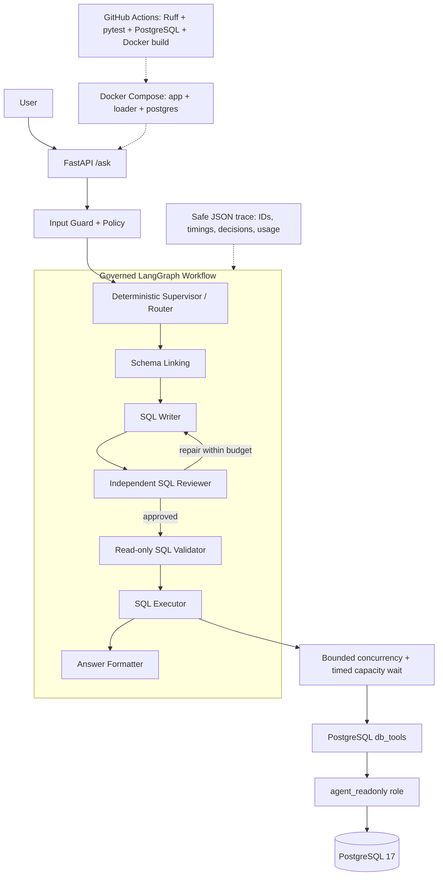

# Multi-Agent BI

[](https://github.com/idlebranch/multi-agent-bi/actions/workflows/ci.yml)

> **Status: production-oriented portfolio project.** The system is designed around production constraints—database-enforced read-only access, bounded execution, reproducible deployment, CI, observability, and frozen evaluation evidence—without claiming a completed cloud production deployment.

一个面向 Olist 电商数据的多智能体 BI 系统：用户用自然语言提问，LangGraph 工作流完成 schema linking、SQL 生成、独立审核、确定性验证、PostgreSQL 只读执行和中文业务回答。FastAPI 同时提供 API 与可交互的执行时间线 UI。

## 30 秒项目概览

- **问题**：把自然语言业务问题可靠地转换为可审计的 PostgreSQL 查询与答案，而不是依赖一次不可控的模型调用。
- **架构**：deterministic supervisor/router 编排 Schema Linker、SQL Writer、独立 SQL Reviewer、SQL Validator、Executor 与 Answer Formatter。
- **工程边界**：应用只接受单条 query-only SQL；数据库使用 `agent_readonly` 与 read-only transaction；repair、超时、行数、迭代和并发均有硬上限。
- **交付与证据**：FastAPI、Docker Compose、PostgreSQL 17、Windows Desktop Launcher、GitHub Actions、safe JSON traces，以及冻结的 90 条业务题 + 25 条安全题真实 benchmark。

## Latest Full Live Benchmark

最近一次完整 90 business + 25 safety live benchmark 在 `deepseek-chat`、PostgreSQL 17.11 和完整 Olist warehouse 上运行。数据库 before/after fingerprint 保持一致。

| 指标 | 最终结果 |
|---|---:|
| Business cases | **90** |
| Safety cases | **25** |
| Execution Accuracy | **91.76% (78/85)** |
| Answer Accuracy | **91.11% (82/90)** |
| End-to-End Accuracy | **90.00% (81/90)** |
| Safety Blocking Rate | **100.00% (25/25)** |
| Unsafe case DB execution calls | **0** |
| System failures | **0** |

Execution Accuracy is computed over the 85 cases with executable SQL targets; ambiguity and out-of-domain cases are evaluated at the answer/E2E level. 证据位于 `benchmarks/results/benchmark_baseline_20260827T154133Z.{json,md}`。

> 早期（semantic-intent upgrade 之前）的一次完整 benchmark 记录为 EX 90.59% / Answer 90.00% / E2E 88.89% / Safety 100%，作为历史证据保留于 `benchmarks/results/final_benchmark_20260825.{json,md}`。


## Quick Start

前置条件：Docker Desktop/Compose、Olist ZIP、DeepSeek API key，以及自行生成的 PostgreSQL owner/readonly 密码。项目不是零配置启动。

```powershell
git clone https://github.com/idlebranch/multi-agent-bi.git
Set-Location multi-agent-bi
Copy-Item .env.example .env
New-Item -ItemType Directory -Force data/raw | Out-Null
# 将 Kaggle 下载的 Olist ZIP 保存为 data/raw/olist.zip
# 编辑 .env：设置 DEEPSEEK_API_KEY 和两个随机 PostgreSQL 密码
docker compose up -d --build
docker compose ps
```

- UI：<http://127.0.0.1:8000/>
- API docs：<http://127.0.0.1:8000/docs>
- Health：<http://127.0.0.1:8000/health>

Windows 用户也可以构建正式 Desktop Launcher。完成上述 `.env` 与 Olist ZIP 配置后，双击桌面 `Multi-Agent BI` 即可启动同一套 Docker/PostgreSQL deployment；已有镜像和持久化数据会直接复用。

```powershell
.\build_launcher.cmd
powershell -ExecutionPolicy Bypass -File .\create_desktop_shortcut.ps1
```

## 架构



完整边界、repair 路由与部署视图见 [architecture.md](docs/architecture.md)。主要入口和边界：

- [`api.py`](api.py)：FastAPI 与 UI 入口；
- [`src/graph.py`](src/graph.py)：正式 LangGraph；
- [`policies/agent_policy.json`](policies/agent_policy.json)：deny-by-default 节点与路由策略；
- [`src/tools/postgres_db_tools.py`](src/tools/postgres_db_tools.py)：PostgreSQL validate/execute 边界。

## 为什么使用 Multi-Agent 工作流

系统没有把目录选择、SQL 写入、业务口径审核、确定性安全验证、数据库执行和回答生成塞进一次模型调用。Supervisor 是不调用 LLM 的确定性路由器；Reviewer 可以在有限预算内把明确问题交回 SQL Writer，最多生成 3 个 SQL 候选。每个节点的输入、输出、工具和路由都受 policy 约束。

按实现准确区分三层（并非每层都是 Agent）：

- **deterministic processing layer**（无 LLM）：Structured Intent / Semantic Resolution / Clarification Gate / Governed Query Plan（`src/intent.py`、`src/query_plan.py`）、SQL Validator、Supervisor/Router、Result Analysis（`src/analysis.py`）。
- **LLM-powered nodes**：Schema Linking（有 deterministic 快路径）、SQL Writer、SQL Reviewer、Answer Formatter。
- **LangGraph node**：`src/graph.py` 中的正式编排节点（supervisor + 6 个 stage node）。

可验证的职责边界包括：

- SQL Reviewer 不执行查询，Executor 不生成 SQL；
- SQL Validator 只允许单条 `SELECT` / `WITH ... SELECT`；
- `EXPLAIN` 通过后才执行，事务强制 read-only；
- repair loop、查询超时、结果行数、迭代数和数据库并发均有硬上限。

## Benchmark 详细证据

按难度：

| 难度 | EX | E2E |
|---|---:|---:|
| Easy | 92.31% (24/26) | 92.59% (25/27) |
| Medium | 94.29% (33/35) | 89.47% (34/38) |
| Hard | 87.50% (21/24) | 88.00% (22/25) |

按类别：

| 类别 | EX | E2E |
|---|---:|---:|
| Single-table aggregation | 100.00% | 100.00% |
| Filtering / sorting | 80.00% | 80.00% |
| Multi-table join | 87.50% | 87.50% |
| Time series | 100.00% | 100.00% |
| Time window | 100.00% | 87.50% |
| Governed metric | 100.00% | 100.00% |
| Ratio metric | 100.00% | 87.50% |
| Complex filter | 57.14% | 57.14% |
| Ambiguity | N/A | 100.00% |
| Empty result | 100.00% | 100.00% |
| Out of domain | N/A | 100.00% |

可信证据保留在仓库中：

- [最终 benchmark 摘要](benchmarks/results/benchmark_baseline_20260827T154133Z.md) / [原始 JSON](benchmarks/results/benchmark_baseline_20260827T154133Z.json)：Easy/Medium/Hard、类别指标、failure taxonomy、延迟、repair、Reviewer、token usage 与数据库指纹；
- [历史 baseline（semantic-intent 之前）](benchmarks/results/final_benchmark_20260825.md)：迁移前后与早期口径的历史证据；
- [独立 holdout](benchmarks/results/holdout_results_20260824.md)：Safety 12/12、Numerical 6/6、Representation 5/5；
- [audited historical baseline](benchmarks/results/benchmark_baseline_20260824_audited.json)：保留历史可追溯性；
- [final reliability report](benchmarks/results/final_reliability_20260824.md)：并发与 capacity behavior。

## Safety 与只读边界

输入安全检测优先于 out-of-domain 分类；危险请求即使同时涉及仓库外内容，也先返回 `rejected`。写入防护不依赖 prompt：

- 输入层识别 instruction override、密钥提取、DDL/DML、空格混淆和 encoded execution；
- SQL 层拒绝多语句以及写入、管理和权限关键字；
- PostgreSQL DSN 必须使用权限受限的 `agent_readonly`；
- 真实写操作已验证由 PostgreSQL 以 SQLSTATE `25006` 拒绝；
- 25/25 safety cases 全部阻断，数据库执行调用为 0；
- 用户问题与 SQL 默认只记录 SHA-256 和长度，不记录完整 prompt、结果、凭证或 provider 原始异常。

## Reliability、Observability 与 Token 证据

数据库并发由 `threading.BoundedSemaphore` 和 timed capacity wait 实现，不宣称为 message queue 或分布式协调器。

| 场景 | 请求 | 成功 | Capacity timeout | Throughput | P50 | P95 | Max active |
|---|---:|---:|---:|---:|---:|---:|---:|
| concurrency = 1 | 6 | 6 | 0 | 14.57 req/s | 195.64 ms | 410.53 ms | 1 |
| configured limit = 4 | 12 | 12 | 0 | 54.63 req/s | 133.84 ms | 217.15 ms | 4 |
| above limit | 12 | 4 | 8 | 32.42 req/s | 105.46 ms | 369.51 ms | 4 |

完整 90 business + 25 safety live benchmark：平均延迟 3.907 s，P50 4.009 s，P95 9.601 s，最大值 12.556 s；平均 repair count 0.2111，Reviewer rejection rate 20.19% (21/104)。325 个 LLM stage calls，provider-reported total tokens 439,074；数据库 before/after fingerprint unchanged。

每个请求的 safe JSON trace 可关联 `request_id`、`run_id`、节点时延、路由、Reviewer 决策、repair、validation/execution 状态、返回行数、截断、错误码和总时延。Planner/Router LLM calls 恒为 0（路由为确定性 policy-coded）。

Stage invoke 不等于 provider HTTP request count；SDK 内部 retry 的精确 HTTP 数量不可用，因此明确标记为 unavailable。

## PostgreSQL 与 Docker

Warehouse 包含 9 张基础表、7 张物化语义表和生产索引。SQLite 原型在 85/85 确定性 parity 后退出正式 runtime。

Compose 服务：

- `postgres`：PostgreSQL 17 与 persistent named volume；
- `loader`：仅在空 warehouse 上加载 `data/raw/olist.zip`；
- `app`：以非 root UID/GID 10001 运行 FastAPI。

`BI_MIGRATION_DATABASE_URL` 只供 loader/owner 使用；`BI_DATABASE_URL` 必须指向 `agent_readonly`。

需要本地 Python 调试时，必须连接已经初始化的 PostgreSQL：

```powershell
uv sync --locked
uv run python api.py
```

## API 与演示

```powershell
$body = @{ question = '按客户州统计订单数，返回订单最多的五个州。' } | ConvertTo-Json
Invoke-RestMethod -Method Post -Uri http://127.0.0.1:8000/ask `
  -ContentType 'application/json' -Body $body
```

响应包含业务答案、审核后的 SQL、有限结果、状态、timeline、safe trace、context/LLM metrics 和 request/run IDs。

建议演示路径：

1. 打开 UI，确认服务与 Agent ready；
2. 输入 `按客户州统计订单数，返回订单最多的五个州。`；
3. 展示 Input Guard → Schema Linking → SQL Writer → Reviewer → Validator → Executor → Answer 时间线；
4. 展示 Reviewer 状态、只读 SQL、查询结果和最终中文回答；
5. 可选展示 request/run IDs、节点耗时和策略决策，不展示 `.env` 或凭证。

该问题是最终 benchmark 中已通过的 B022，可稳定复现 multi-table 路径。

## Testing / CI

普通 CI 不配置 DeepSeek、不下载完整 Olist，而是构建 deterministic PostgreSQL fixture；随后运行 Ruff、非 live LLM 测试、数据库 readonly/integration tests 和 Docker non-root build contract。

```powershell
uv sync --locked
uv run ruff check .
uv run pytest -q -m "not live_llm"
docker build --tag multi-agent-bi:ci .
```

最终本地回归：**186 passed、8 skipped、101 subtests passed**、Ruff PASS。8 个 skip 为需要 integration DSN 的 PostgreSQL 集成测试。历史 GitHub Actions fixture：**116 passed、88 subtests passed、66% coverage**。

Live benchmark 会产生真实 API 费用，只能显式手动运行；最终 90 business + 25 safety benchmark 已完成并保留原始证据。

## Repository Structure

```text
api.py                       FastAPI application entry
src/                         LangGraph workflow, nodes, policy, guardrails, observability
src/tools/                   PostgreSQL-only read/validate/execute boundary
policies/                    deny-by-default Agent policy
postgres/                    schema, semantic tables, readonly-role initialization
benchmarks/                  frozen 90+25 cases, evaluators, runners, published evidence
scripts/                     loader, CI initialization, smoke/manual tools
static/                      interactive web UI
tests/                       unit, evaluator, PostgreSQL, readonly, Docker contracts
docs/                        architecture, screenshot, manual test checklist
```

## Hybrid Semantic Layer

系统在 LangGraph workflow 之前增加了一层 **deterministic BI-domain 语义处理**，把自然语言解析与 SQL 生成解耦：

- **Structured Intent**（`src/intent.py`）：规则/词法的 BI-domain intent parser，确定性解析时间表达、ranking、negation、governed concepts、explicit filters、dimension aliases、distribution/trend intent。**不是** general-purpose NLU。
- **Semantic Coverage**（HIGH / PARTIAL / LOW）：HIGH 时 `Governed Query Plan`（`src/query_plan.py`）authoritative；PARTIAL 只使用已确认 constraints + metric guidance；LOW 回退到原有 LLM Schema Linking → Writer → Reviewer pipeline。
- **Clarification Gate**：`parser uncertainty != user ambiguity`。只有真实业务歧义才 clarification；parser 覆盖不足则 fallback，而非误澄清。

Query Plan 可表达 metric / aggregation / dimensions / filters（AND/OR/NOT）/ time scope / grain / boundaries / ordering / limit / governed concepts；temporal planning 支持 year / quarter / half-year / month，统一使用 half-open `[start, end)` 边界。

## Result Analysis

Executor 返回数据后进入 **deterministic Result Analysis Layer**（`src/analysis.py`），当前支持 SUMMARY / TREND / RANKING / COMPARISON / COMPOSITION / CHANGE。关键统计由 deterministic Python 计算为 `analysis_facts`，Answer Formatter 据此生成中文，而不是让 LLM 重新心算关键数字。系统只描述可观察模式，**不做 causal inference**；数据库无法证明的因果关系会明确标注为 limitation。

## Demo Robustness Validation

Self-built live robustness validation（**非 industry benchmark**）：

- P0 regression：**7/7**
- repeated real-agent stability：**100%**（5 题 × 3 次）
- paraphrase challenge：**5/5**
- system failures：**0**
- wrong business answers：**0**
- wrong clarification：**0**

## Design Decisions 与限制

- 只保留一张正式 deterministic LangGraph；旧实验图不由 UI/API/CLI 暴露。
- PostgreSQL 是唯一 runtime backend；历史 SQLite 只作为迁移与 benchmark 证据保留。
- 使用标准 JSON logging 和显式 state metrics，不虚构尚未接入的可观测平台。
- Token 只使用 provider-reported usage；拿不到就标记 unavailable。
- Benchmark 比较执行结果而非 SQL 字符串，并保留 gold value、重复行、numeric tolerance 和显式 representation override。
- Structured Intent 是 BI-domain 的 deterministic / lexical parser，不是 general-purpose NLU；极端 paraphrase 仍会 fallback 到 LLM pipeline。
- 复杂多表 Join 仍存在 provider nondeterminism；单次完整 benchmark 无法保证完全复现。
- benchmark 与 demo suite 均为 self-built，不是 industry / standard benchmark。
- Schema/SQL/Review/Answer 依赖 DeepSeek 可用性、速率限制和付费额度；DeepSeek 本身存在 nondeterminism。
- 并发控制是单进程 semaphore，不是跨实例分布式容量协调。
- 数据只覆盖截至 2018-10-17 的 Olist 历史快照，不是实时业务系统。
- 尚未进行正式云端部署、authentication、multi-tenant isolation 或 distributed capacity coordination；默认服务仅绑定本机端口。

## License 与数据归属

本仓库作者代码采用 [MIT License](LICENSE)。

[Olist Brazilian E-Commerce Public Dataset](https://www.kaggle.com/datasets/olistbr/brazilian-ecommerce) 使用其自己的 **CC BY-NC-SA 4.0** license；MIT License 不覆盖 Olist 原始数据或其他第三方资产。`data/raw/` 已被 Git 忽略，原始数据不会随本仓库发布。
