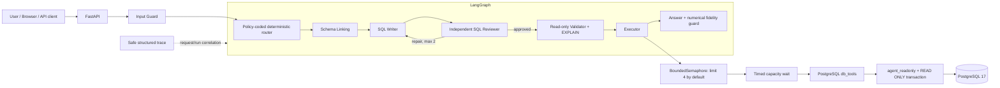
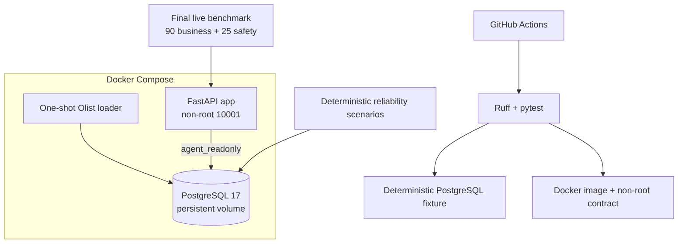

# Production Architecture

## Request path

The Production router is deterministic. It makes zero planner/router LLM calls. Schema Linking can use governed table selection without an LLM or make one catalog call; SQL Writer, Reviewer, and Answer are the observable LLM stages. Repair calls are additional SQL Writer calls within the same fixed budget.

## Capacity semantics

The database boundary uses an in-process `threading.BoundedSemaphore` plus a timed acquire. This is bounded concurrency with bounded waiting, not a message queue. There is no queue broker, persistent queue, worker consumer, or configured queue length. A caller that cannot acquire capacity within the timeout receives the compatibility error code `queue_timeout`, with a message that identifies a database capacity-wait timeout.

## Deployment and verification

Production data loading requires the external Olist ZIP and owner credentials. Runtime queries use a separate readonly role. CI never needs DeepSeek credentials or the full Olist ZIP.

## Observability boundary

One JSON summary record is emitted per workflow run with:

- `request_id`, `run_id`, UTC timestamp and total latency;
- node names, attempt numbers, statuses and duration;
- routing/review decisions, repair count and numerical-fidelity outcome;
- validation/execution status, row count, truncation, capacity wait and error code;
- available/selected schema counts and actual context character sizes;
- actual workflow LLM stage calls and provider-reported token usage when present.

It intentionally excludes full user prompts, SQL text, database results, credentials and provider exception messages. Questions and SQL are represented by SHA-256 plus length.
